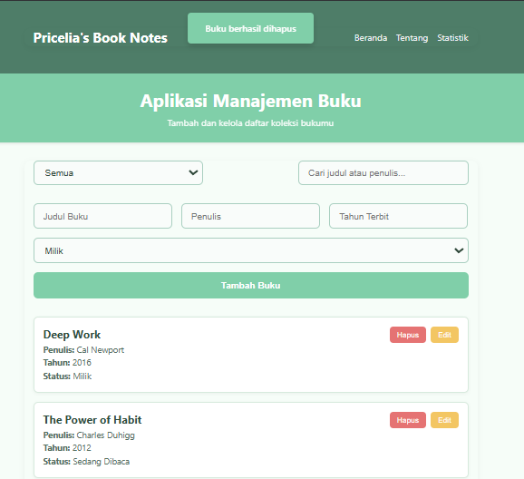

# Aplikasi Manajemen Buku Pribadi

## Deskripsi Aplikasi

Aplikasi ini merupakan sistem manajemen buku berbasis React yang memungkinkan pengguna mencatat dan mengelola koleksi buku pribadi mereka. Pengguna dapat menambahkan buku yang dimiliki, sedang dibaca, atau ingin dibeli, serta melakukan pencarian, pengeditan, dan penghapusan data buku.

## Cara Instalasi

1. Clone repositori ini:

   ```bash
   git clone https://github.com/username/book-management-app.git
   cd book-management-app
   ```

2. Install dependencies:

   ```bash
   npm install
   ```

3. Jalankan aplikasi:
   ```bash
   npm start
   ```

Aplikasi akan berjalan di `http://localhost:3000`

## Screenshot Antarmuka

**Home Page:**
Menampilkan daftar buku, form tambah/edit, dan fitur filter & pencarian.


**Stats Page:**
Menampilkan statistik jumlah buku berdasarkan status koleksi.


**Alert:**


## Penjelasan Penggunaan Fitur React

### 1. useState dan useEffect

- Digunakan dalam `BookForm.jsx` dan `Home.jsx` untuk mengelola input form dan state editing:

```js
const [title, setTitle] = useState("");
useEffect(() => {
  if (editingBook) { ... }
}, [editingBook]);
```

### 2. Context API untuk State Management

- `BookContext.js` dan `AlertContext.js` mengatur global state menggunakan `createContext` dan `useContext`:

```js
<BookProvider>
  <AlertProvider>
    <App />
  </AlertProvider>
</BookProvider>
```

### 3. React Router

- Digunakan di `App.js` untuk membuat navigasi antar halaman:

```js
<Routes>
  <Route path="/" element={<Home />} />
  <Route path="/stats" element={<Stats />} />
</Routes>
```

### 4. Komponen Reusable

- Komponen modular seperti `BookForm`, `BookItem`, `BookFilter`, `Header`, dan `Alert` digunakan berulang.

### 5. Penyimpanan dengan localStorage

- Diterapkan melalui custom hook `useLocalStorage.js`:

```js
const [books, setBooks] = useLocalStorage("books", []);
```

### 6. Custom Hooks

- `useLocalStorage.js`: menyimpan dan mengambil data dari localStorage.
- `useBookStats.js`: menghitung jumlah buku berdasarkan status.

### 7. PropTypes

- Validasi properti digunakan di semua komponen:

```js
BookForm.propTypes = { onAddBook: PropTypes.func.isRequired, ... };
```

### 8. Error Handling

- Validasi input form dengan alert jika data tidak lengkap:

```js
if (!title.trim()) showAlert("Semua field wajib diisi!", "error");
```

## Laporan Hasil Testing

Pengujian unit dilakukan dengan React Testing Library pada:

- BookForm (`BookForm.test.jsx`)
- BookItem (`BookItem.test.jsx`)
- BookFilter (`BookFilter.test.jsx`)
- Home Page (`Home.test.jsx`)
- Stats Page (`Stats.test.jsx`)

Setiap file test mencakup:

- Rendering komponen
- Simulasi interaksi user
- Validasi pemanggilan fungsi callback dan output yang ditampilkan

Contoh:

```js
expect(mockAdd).toHaveBeenCalledWith(
  expect.objectContaining({
    title: "Buku Testing",
  })
);
```


